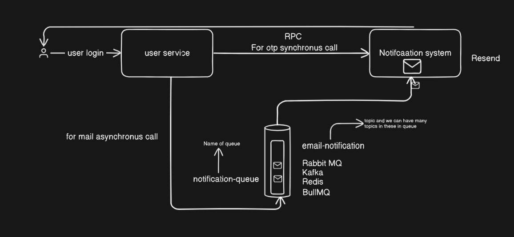

# Notification System with RPC-based Microservice Communication

This project demonstrates a clean implementation of a **microservice-based notification system** using lightweight technologies like **Hono**, **Redis**, **BullMQ**, and **MongoDB**. It also showcases how services can communicate internally using **RPC-style HTTP calls** to keep logic distributed, testable, and scalable.

---

## Architecture Overview

The system is composed of three independent services:

| Service                | Port | Responsibility                              |
| ---------------------- | ---- | ------------------------------------------- |
| `api-gateway`          | 3000 | Exposes public-facing APIs                  |
| `user-service`         | 3002 | Manages user-related operations and MongoDB |
| `notification-service` | 3001 | Handles email notifications and queueing    |

---

## Core Flow and Communication

### 1. Send OTP (Synchronous RPC)

* `api-gateway` exposes a `/send-otp` route.
* It forwards the request to `notification-service` on port `3001`.
* The email is sent immediately using Resend API.
* This demonstrates **synchronous service-to-service communication** using internal HTTP calls (RPC-style).

### 2. User Registration (Chained RPC + Async Email Queue)

* A client hits `/register` on `api-gateway`.
* It forwards the user data to `user-service` (port `3002`) to create a user.
* After successful creation, it sends a follow-up request to `notification-service` (port `3001`) to send a welcome email.
* The notification is enqueued using BullMQ and processed by a background worker.
* This demonstrates both **chained RPC communication** and **asynchronous background job processing**.

---


## Project Architecture Diagram

To help you visualize how services interact, here's a simple diagram showing the flow between services:





---


## Technologies Used

* **Hono** (minimal HTTP server)
* **MongoDB** (user data storage)
* **Redis** (message broker for queue)
* **BullMQ** (job queue for email delivery)
* **Resend API** (email delivery service)
* Internal **RPC-style communication** over HTTP using `fetch` between services

---

## Running the Application Locally

### Prerequisites

* Node.js
* Redis
* MongoDB
* Resend account

### Step 1: Clone the Repository

```bash
git clone https://github.com/priyanshu-tiwariii/notification-system.git
cd notification-system
```

### Step 2: Start Required Dependencies

```bash
# Start Redis and MongoDB (Docker or local install)
docker run -p 6379:6379 redis
docker run -p 27017:27017 mongo
```

### Step 3: Start Services (each in a separate terminal)

```bash
# API Gateway (Port 3000)
cd api-gateway
pnpm install
pnpm run dev

# User Service (Port 3002)
cd ../user-service
pnpm install
pnpm run dev

# Notification Service (Port 3001)
cd ../notification-service
pnpm install
pnpm run dev

```

---

## Example API Calls

### 1. Send OTP (Synchronous RPC)

```http
POST  http://localhost:3000/user/api/v1/user/register/send-otp

Body:
{
  "email": "someone@example.com"
}
```

### 2. Register User (Async Email via BullMQ)

```http
POST  http://localhost:3000/user/api/v1/user/register

Body:
{
  "name": "Test User",
  "email": "test@example.com",
  "password" : "abcdefgh",
  "otp" : 123456
}
```

---

## Environment Variables

In `notification-service/.env`:

```
RESEND_API_KEY=your_resend_api_key
FROM_EMAIL=your_verified_sender_email
```

---

## How RPC Works in This Project

All inter-service communication is done using **HTTP fetch** calls, mimicking a lightweight **RPC-style interaction**.

* `api-gateway` does not contain core logic.
* Instead, it acts as an orchestrator and forwards requests to downstream services.
* This keeps services independent and scalable, allowing logic to evolve in isolation.

---


## Future Improvements

* Replace HTTP-based RPC with gRPC or message broker for service discovery and speed.
* Add retry logic and error handling for the job queue.
* Extend support for SMS or push notifications.
* Add user authentication and rate limiting.

---
## Contact

For any questions, improvements, or contributions, feel free to reach out:

* **LinkedIn**: [linkedin.com/in/priyanshu-tiwarii](https://www.linkedin.com/in/priyanshu-tiwarii/)
* **Email**: *[priyanshu-tiwari@hotmail.com](mailto:priyanshu-tiwari@hotmail.com)


